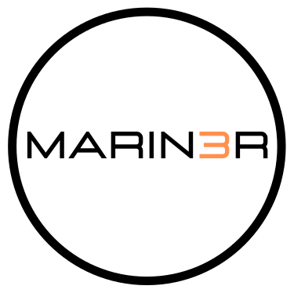

</img>

[](https://goreportcard.com/report/github.com/3scale-ops/marin3r)
[](https://codecov.io/gh/3scale-ops/marin3r)
[](https://github.com/3scale-ops/marin3r/actions/workflows/build.yaml)
[](https://github.com/3scale-ops/marin3r/blob/master/LICENSE)

Lighweight, CRD based Envoy control plane for Kubernetes:

- Implemented as a Kubernetes Operator
- Deploy and manage an Envoy xDS server using the DiscoveryService custom resource
- Inject Envoy sidecar containers based on Pod annotations
- Deploy Envoy as a Kubernetes Deployment using the EnvoyDeployment custom resource
- Dynamic Envoy configuration using the EnvoyConfig custom resource
- Use any secret of type `kubernetes.io/tls` as a certificate source
- Syntactic validation of Envoy configurations
- Self-healing
- Controls Envoy connnection draining and graceful shutdown whenever pods are terminated

<!-- omit in toc -->
## Table of Contents

- [**Overview**](#overview)
- [**Getting started**](#getting-started)
  - [**Installation**](#installation)
    - [**Install using OLM**](#install-using-olm)
    - [**Install using kustomize**](#install-using-kustomize)
  - [**Deploy a discovery service**](#deploy-a-discovery-service)
  - [**Next steps**](#next-steps)
- [**Configuration**](#configuration)
  - [**API reference**](#api-reference)
  - [**EnvoyConfig custom resource**](#envoyconfig-custom-resource)
  - [**Secrets**](#secrets)
  - [**Sidecar injection configuration**](#sidecar-injection-configuration)
- [**Use cases**](#use-cases)
  - [**Ratelimit**](#ratelimit)
- [**Design docs**](#design-docs)
  - [**Discovery service**](#discovery-service)
  - [**Sidecar injection**](#sidecar-injection)
  - [**Operator**](#operator)
- [**Development**](#development)
- [**Release**](#release)

## **Overview**

MARIN3R is a Kubernetes operator to manage a fleet of Envoy proxies within a Kubernetes cluster. It takes care of the deployment of the proxies and manages their configuration, feeding it to them through a discovery service using Envoy's [xDS protocol](https://www.envoyproxy.io/docs/envoy/latest/api-docs/xds_protocol). This allows for dynamic reconfiguration of the proxies without any reloads or restarts, favoring the ability to perform configuration changes in a non-disruptive way.

Users can write their Envoy configurations by making use of [Kubernetes Custom Resources](https://kubernetes.io/docs/concepts/extend-kubernetes/api-extension/custom-resources/) that the operator will watch and make available to the proxies through the discovery service. Configurations are defined making direct use of Envoy's v3 APIs so anything supported in the Envoy APIs is available in MARIN3R. See the [configuration section](#configuration) or the [API reference](docs/api-reference/reference.asciidoc) for more details.

A great way to use this project is to have your own operator generating the Envoy configurations that your platform/service requires by making use of MARIN3R APIs. This way you can just focus on developing the Envoy configurations you need and let MARIN3R take care of the rest.

## **Getting started**

### **Installation**

MARIN3R can be installed either by using [kustomize](https://kustomize.io/) or by using [Operator Lifecycle Manager (OLM)](https://github.com/operator-framework/operator-lifecycle-manager). We recommend using OLM installation whenever possible.

#### **Install using OLM**

OLM is installed by default in Openshift 4.x clusters. For any other Kubernetes flavor, check if it is already installed in your cluster. If not, you can easily do so by following the [OLM install guide](https://github.com/operator-framework/operator-lifecycle-manager/blob/master/doc/install/install.md).

Once OLM is installed in your cluster, you can proceed with the operator installation by applying the install manifests. This will create a namespaced install of MARIN3R that will only watch for resources in the `default` namespace, with the operator deployed in the `marin3r-system` namespace. Modify the field `spec.targetNamespaces` of the OperatorGroup resource in `examples/quickstart/olm-install.yaml` to modify the namespaces that MARIN3R will watch. A cluster scoped installation through OLM is currently not supported (check the kustomize based installation for cluster scope installation of the operator).

```bash
kubectl apply -f examples/quickstart/olm-install.yaml
```

Wait until you see the following Pods running:

```bash
▶ kubectl -n marin3r-system get pods | grep Running
marin3r-catalog-qsx9t                                             1/1     Running     0          103s
marin3r-controller-manager-5f97f86fc5-qbp6d                       2/2     Running     0          42s
marin3r-controller-webhook-5d4d855859-67zr6                       1/1     Running     0          42s
marin3r-controller-webhook-5d4d855859-6972h                       1/1     Running     0          42s
```

#### **Install using kustomize**

This method will install MARIN3R with cluster scope permissions in your cluster. It requires [cert-manager](https://cert-manager.io/) to be present in the cluster.

To install cert-manager you can execute the following command in the root directory of this repository:

```bash
make deploy-cert-manager
```

You can also refer to the [cert-manager install documentation](https://cert-manager.io/docs/installation/).

Once cert-manager is available in the cluster, you can install MARIN3R by issuing the following command:

```bash
kustomize build config/default | kubectl apply -f -
```

After a while you should see the following Pods running:

```bash
▶ kubectl -n marin3r-system get pods
NAME                                          READY   STATUS    RESTARTS   AGE
marin3r-controller-manager-6c45f7675f-cs6dq   2/2     Running   0          31s
marin3r-controller-webhook-684bf5bbfd-cp2x4   1/1     Running   0          31s
marin3r-controller-webhook-684bf5bbfd-zdvrk   1/1     Running   0          31s
```

### **Deploy a discovery service**

A discovery service is a Pod that users need to deploy in their namespaces to provide such namespaces with the ability to configure Envoy proxies dynamically using configurations loaded from Kubernetes Custom Resources. This Pod runs a couple of Kubernetes controllers as well as an Envoy xDS server. To deploy a discovery service users make use of the DiscoveryService custom resource that MARIN3R provides. The DiscoveryService is a namespace scoped resource, so one is required for each namespace where Envoy proxies are going to be deployed.

Continuing with our example, we are going to deploy a DiscoveryService resource in the `default` namespace of our cluster:

```bash
cat <<'EOF' | kubectl apply -f -
apiVersion: operator.marin3r.3scale.net/v1alpha1
kind: DiscoveryService
metadata:
  name: discoveryservice
  namespace: default
EOF
```

After a while you should see the discovery service Pod running:

```bash
▶ kubectl -n default get pods
NAME                                READY   STATUS    RESTARTS   AGE
marin3r-discoveryservice-676b5cd7db-xk9rt   1/1     Running   0          4s
```

### **Next steps**

After installing the operator and deploying a DiscoveryService into a namespace, you are ready to start deploying and configuring Envoy proxies within the namespace. You can review the different walkthroughs within this repo to learn more about MARIN3R and its capabilities.

- Walkthrough: [TLS offloading with Envoy sidecars](docs/walkthroughs/tls-offloading-sidecars.md)
- Walkthrough: [Path routing using Envoy in a Kubernetes Deployment](docs/walkthroughs/path-routing-envoydeployment.md)
- Walkthrough: [Validation of Envoy resources](docs/walkthroughs/configuration-validation.md)
- Walkthrough: [Self-Healing](docs/walkthroughs/self-healing.md)
- Walkthrough: [Connection draining with the shutdown manager](docs/walkthroughs/envoy-connection-draining-on-shutdown.md)
- Walkthrough: [Upgrading Envoy API from v2 to v3](docs/walkthroughs/upgrading-v2-to-v3.md)

## **Configuration**

### **API reference**

The full MARIN3R API reference can be found [here](docs/api-reference/reference.asciidoc)

### **EnvoyConfig custom resource**

MARIN3R most core functionality is to feed the Envoy configurations defined in EnvoyConfig custom resources to an Envoy discovery service. The discovery service then sends the resources contained in those configurations to the Envoy proxies that identify themselves with the same `nodeID` defined in the EnvoyConfig resource.

Commented example of an EnvoyConfig resource:

```yaml
cat <<'EOF' | kubectl apply -f -
apiVersion: marin3r.3scale.net/v1alpha1
kind: EnvoyConfig
metadata:
  # name and namespace uniquelly identify an EnvoyConfig but are
  # not relevant in any other way
  name: config
spec:
  # nodeID indicates that the resources defined in this EnvoyConfig are relevant
  # to Envoy proxies that identify themselves to the discovery service with the same
  # nodeID. The nodeID of an Envoy proxy can be specified using the "--node-id" command
  # line flag
  nodeID: proxy
  # Resources can be written either in json or in yaml, being json the default if
  # not specified
  serialization: json
  # Resources can be written using Envoy API v3.
  envoyAPI: v3
  # envoyResources is where users can write the different type of resources supported by MARIN3R
  envoyResources:
    # the "secrets" field holds references to Kubernetes Secrets. Only Secrets of type
    # "kubernetes.io/tls" can be referenced. Any certificate referenced from another Envoy
    # resource (for example a listener or a cluster) needs to be present here so marin3r
    # knows where to get the certificate from.
    secrets:
        # name is the name of the kubernetes Secret that holds the certificate and by which it can be
        # referenced to from other resources
      - name: certificate
    # Endpoints is a list of the Envoy ClusterLoadAssignment resource type.
    # API V3 reference: https://www.envoyproxy.io/docs/envoy/latest/api-v3/config/endpoint/v3/endpoint.proto
    endpoints:
      - value: {"clusterName":"cluster1","endpoints":[{"lbEndpoints":[{"endpoint":{"address":{"socketAddress":{"address":"127.0.0.1","portValue":8080}}}}]}]}
    # Clusters is a list of the Envoy Cluster resource type.
    # API V3 reference: https://www.envoyproxy.io/docs/envoy/latest/api-v3/config/cluster/v3/cluster.proto
    clusters:
      - value: {"name":"cluster1","type":"STRICT_DNS","connectTimeout":"2s","loadAssignment":{"clusterName":"cluster1","endpoints":[]}}
    # Routes is a list of the Envoy Route resource type.
    # API V3 reference: https://www.envoyproxy.io/docs/envoy/latest/api-v3/config/route/v3/route.proto
    routes:
      - value: {"name":"route1","virtual_hosts":[{"name":"vhost","domains":["*"],"routes":[{"match":{"prefix":"/"},"direct_response":{"status":200}}]}]}
    # ScopedRoutes is a list of the Envoy Scoped Route resource type.
    # API V3 reference: https://www.envoyproxy.io/docs/envoy/latest/api-v3/config/route/v3/scoped_route.proto
    scopedRoutes:
      - value: {"name":"scoped_route1","route_configuration_name":"route1","key":{"fragments":[{"string_key":"test"}]}}
    # Listeners is a list of the Envoy Listener resource type.
    # API V3 reference: https://www.envoyproxy.io/docs/envoy/latest/api-v3/config/listener/v3/listener.proto
    listeners:
      - value: {"name":"listener1","address":{"socketAddress":{"address":"0.0.0.0","portValue":8443}}}
    # Runtimes is a list of the Envoy Runtime resource type.
    # API V3 reference: https://www.envoyproxy.io/docs/envoy/latest/api-v3/service/runtime/v3/rtds.proto
    runtimes:
      - value: {"name":"runtime1","layer":{"static_layer_0":"value"}}
    # ExtensionConfigs is a list of the envoy ExtensionConfig resource type
    # API V3 reference: https://www.envoyproxy.io/docs/envoy/latest/api-v3/config/core/v3/extension.proto
    extensionConfigs:
      - value: {"name":"http_filter1","typed_config":{"@type":"type.googleapis.com/envoy.extensions.filters.http.router.v3.Router","dynamic_stats":false}}
```

### **Secrets**

Secrets are treated in a special way by MARIN3R as they contain sensitive information. Instead of directly declaring an Envoy API secret resource in the EnvoyConfig CR, you have to reference a Kubernetes Secret, which should exists in the same namespace. MARIN3R expects this Secret to be of type `kubernetes.io/tls` and will load it into an Envoy secret resource. This way you avoid having to insert sensitive data into the EnvoyConfig resources and allows you to use your regular kubernetes Secret management workflow for sensitive data.

Other approach that can be used is to create certificates using cert-manager because cert-manager also uses `kubernetes.io/tls` Secrets to store the certificates it generates. You just need to point the references in your EnvoyConfig to the proper cert-manager generated Secret.

To use a certificate from a kubernetes Secret refer it like this from an EnvoyConfig:

```yaml
spec:
  envoyResources:
    secrets:
      - name: certificate
```

This certificate can then be referenced in an Envoy cluster/listener with the following snippet (check the kuard example):

```yaml
transport_socket:
  name: envoy.transport_sockets.tls
  typed_config:
    "@type": "type.googleapis.com/envoy.extensions.transport_sockets.tls.v3.DownstreamTlsContext"
    common_tls_context:
      tls_certificate_sds_secret_configs:
        - name: certificate
          sds_config: { ads: {}, resource_api_version: "V3" }
```

### **Sidecar injection configuration**

The MARIN3R mutating admission webhook will inject Envoy containers in any Pod annotated with `marin3r.3scale.net/node-id` and labelled with `marin3r.3scale.net/status=enabled`. The following annotations can be used in Pods to control the behavior of the sidecar injection:

| annotations                                               | description                                                                                                                                                                                                    | default value                                            |
| --------------------------------------------------------- | -------------------------------------------------------------------------------------------------------------------------------------------------------------------------------------------------------------- | -------------------------------------------------------- |
| marin3r.3scale.net/node-id                                | Envoy's node-id                                                                                                                                                                                                | N/A                                                      |
| marin3r.3scale.net/cluster-id                             | Envoy's cluster-id                                                                                                                                                                                             | same as node-id                                          |
| marin3r.3scale.net/envoy-api-version                      | Envoy's API version (only v3 allowed)                                                                                                                                                                          | v3                                                       |
| marin3r.3scale.net/container-name                         | the name of the Envoy sidecar                                                                                                                                                                                  | envoy-sidecar                                            |
| marin3r.3scale.net/ports                                  | the exposed ports in the Envoy sidecar                                                                                                                                                                         | N/A                                                      |
| marin3r.3scale.net/host-port-mappings                     | Envoy sidecar ports that will be mapped to the host. This is used for local development, no recommended for production use.                                                                                    | N/A                                                      |
| marin3r.3scale.net/envoy-image                            | the Envoy image to be used in the injected sidecar container                                                                                                                                                   | envoyproxy/envoy:v1.20.0                                 |
| marin3r.3scale.net/config-volume                          | the Pod volume where the ads-configmap will be mounted                                                                                                                                                         | envoy-sidecar-bootstrap                                  |
| marin3r.3scale.net/tls-volume                             | the Pod volume where the marin3r client certificate will be mounted.                                                                                                                                           | envoy-sidecar-tls                                        |
| marin3r.3scale.net/client-certificate                     | the marin3r client certificate to use to authenticate to the marin3r control plane (marin3r uses mTLS))                                                                                                        | envoy-sidecar-client-cert                                |
| marin3r.3scale.net/envoy-extra-args                       | extra command line arguments to pass to the Envoy sidecar container                                                                                                                                            | ""                                                       |
| marin3r.3scale.net/admin.port                             | Envoy's admin port                                                                                                                                                                                             | 9901                                                     |
| marin3r.3scale.net/resources.limits.cpu                   | Envoy sidecar container resource cpu limits. See [syntax format](https://v1-17.docs.kubernetes.io/docs/reference/generated/kubernetes-api/v1.17/#quantity-resource-core) to specify the resource quantity      | N/A                                                      |
| marin3r.3scale.net/admin.port                             | Envoy's admin api port                                                                                                                                                                                         | 9901                                                     |
| marin3r.3scale.net/admin.bind-address                     | Envoy's admin api bind address                                                                                                                                                                                 | 0.0.0.0                                                  |
| marin3r.3scale.net/admin.access-log-path                  | Envoy's admin api access logs path                                                                                                                                                                             | /dev/null                                                |
| marin3r.3scale.net/resources.limits.memory                | Envoy sidecar container resource memory limits. See [syntax format](https://v1-17.docs.kubernetes.io/docs/reference/generated/kubernetes-api/v1.17/#quantity-resource-core) to specify the resource quantity   | N/A                                                      |
| marin3r.3scale.net/resources.requests.cpu                 | Envoy sidecar container resource cpu requests. See [syntax format](https://v1-17.docs.kubernetes.io/docs/reference/generated/kubernetes-api/v1.17/#quantity-resource-core) to specify the resource quantity    | N/A                                                      |
| marin3r.3scale.net/resources.requests.memory              | Envoy sidecar container resource memory requests. See [syntax format](https://v1-17.docs.kubernetes.io/docs/reference/generated/kubernetes-api/v1.17/#quantity-resource-core) to specify the resource quantity | N/A                                                      |
| marin3r.3scale.net/shutdown-manager.enabled               | Enable or disables Envoy shutdown manager for graceful shutdown of the Envoy server (true/false)                                                                                                               | false                                                    |
| marin3r.3scale.net/shutdown-manager.port                  | Envoy's shutdown manager server port                                                                                                                                                                           | 8090                                                     |
| marin3r.3scale.net/shutdown-manager.image                 | Envoy's shutdown manager image                                                                                                                                                                                 | If unset, the operator will select the appropriate image |
| marin3r.3scale.net/init-manager.image                     | Envoy's init manager image                                                                                                                                                                                     | If unset, the operator will select the appropriate image |
| marin3r.3scale.net/shutdown-manager.extra-lifecycle-hooks | Comma separated list of container names whose stop should be coordinated with the shutdown-manager. You usually would want to add containers that act as upstream clusters for the Envoy sidecar               | N/A                                                      |
| marin3r.3scale.net/shutdown-manager.drain-time            | The time in seconds that Envoy will drain connections during a shutdown or when individual listeners are being modified or removed via LDS.                                                                    | 300                                                      |
| marin3r.3scale.net/shutdown-manager.drain-strategy        | Determine behaviour of Envoy during the shutdown drain sequence https://www.envoyproxy.io/docs/envoy/latest/operations/cli#cmdoption-drain-strategy                                                            | gradual                                                  |

<!-- omit in toc -->
#### `marin3r.3scale.net/ports` syntax

The `port` syntax is a comma-separated list of `name:port[:protocol]` as in `"envoy-http:1080,envoy-https:1443"`.

<!-- omit in toc -->
#### `marin3r.3scale.net/host-port-mappings` syntax

The `host-port-mappings` syntax is a comma-separated list of `container-port-name:host-port-number` as in `"envoy-http:1080,envoy-https:1443"`.

## **Use cases**

### [**Ratelimit**](/docs/use-cases/ratelimit/README.md)

## **Design docs**

For an in-depth look at how MARIN3R works, check the [design docs](/docs/design).

### [**Discovery service**](/docs/design/discovery-service.md)

### [**Sidecar injection**](/docs/design/sidecar-injection.md)

### [**Operator**](/docs/design/operator.md)

## **Development**

You can find development documentation [here](/docs/development/README.md).

## **Release**

You can find release process documentation [here](/docs/release.md).
