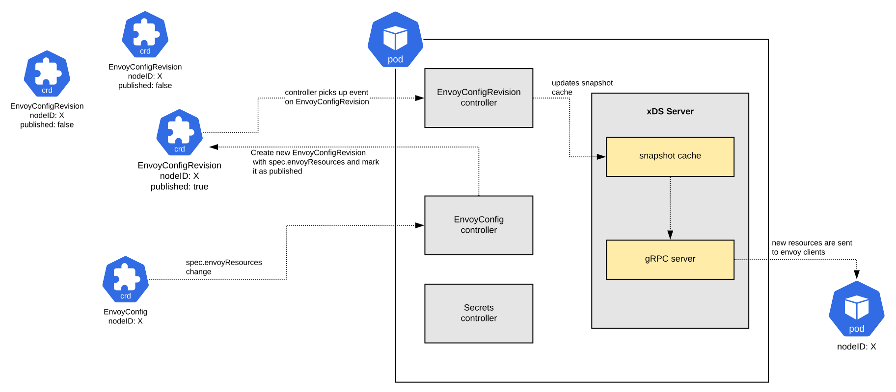

<!-- omit in toc -->
# Discovery Service

The discovery service is the piece of marin3r in charge of delivering envoy configurations to envoy proxies. It uses [aggregated discovery service](https://www.envoyproxy.io/docs/envoy/v1.16.0/api-docs/xds_protocol#aggregated-discovery-service) protocol, one of the variants of [envoy's xDS protocols](https://www.envoyproxy.io/docs/envoy/v1.16.0/api-docs/xds_protocol). The implementation of the discovery service gRPC server is based on [envoy/proxy/go-control-plane](https://github.com/envoyproxy/go-control-plane).

Two kubernetes controllers run alongside the discovery service server: the EnvoyConfig controller and the EnvoyConfigRevision controller. Toghether with the xDS server, they are the core of marin3r functionality.

As of today, the discovery service run in a single pod.

- [Configuration as CRDs](#configuration-as-crds)
- [Envoy nodeIDs](#envoy-nodeids)
  - [Command line parameters](#command-line-parameters)
  - [Static config](#static-config)
- [Certificates](#certificates)
  - [Certificate updates](#certificate-updates)

## Configuration as CRDs

The mechanism by which configurations get to the discovery service server and are then delivered to envoy proxies follows the follwing design:

* Users or other software/controllers create EnvoyConfig custom resources in the Kubernetes API. The EnvoyConfig controller watches these resources and generates owned EnvoyConfigRevision custom resources, one per version of the envoy resources contained in the EnvoyConfig custom resource (in the `spec.envoyResources` field), up to a maximum of 10. This is effectively a list of the config versions that have been applied to a set of envoy proxies over time.

* Only one of the EnvoyConfigRevisions holds the current version of the config. This is called the **published version** and is marked in the EnvoyConfigRevision with the `RevisionPublished` condition. It is the EnvoyConfig controller the one deciding which of its owned EnvoyConfigRevisions is the one actually published. The algorithm used to decide which is one it should be is:

    1. EnvoyConfig controller keeps a list of EnvoyConfigRevision references in `status.configRevisions`, ordered by time of publication. The last published revision holds the highest array index position.
    2. Revisions are versioned by computing the hash of the `spec.envoyResources` field.
    3. The revision with the highest array index that is not marked with the `RevisionTainted` condition is marked with the `RevisionPublished` condition, effectively getting it published.
    4. All other owned EnvoyConfigRevisions get the `RevisionPublished` condition set to `false`.

* When an EnvoyConfig resource gets updated, the hash of `spec.envoyResources` is recalculated and a new EnvoyConfigRevision for that hash is created. If an EnvoyConfigRevision already exists that matches the hash, the existing reference in `status.configRevisions` that points to that EnvoyConfigRevision gets moved to the array's highest index position, effectively triggering the publication of that revision.

* The EnvoyConfigRevision controller watches events on EnvoyConfigRevision custom resources. Whenever it receives an event on one, it checks if the revision is marked as published. If so, loads the envoy resources from serizalized format into proto message objects and writes them to the xDS server in-memory cache. The xDS server will start delivering the new config to the envoy proxies as soon as it detects changes in the in-memory cache.

* The xDS server detects when the config sent to an envoy proxy is not valid due to the [NACKs](https://www.envoyproxy.io/docs/envoy/v1.16.0/api-docs/xds_protocol#basic-protocol-overview) defined in the xDS protocol. This is done by a callback function that inspects the DiscoveryRequest messages received by the server looking for NACKs. Whenever a NACK is detected, the callback function marks the relevant EnvoyConfigRevision custom resource with the `RevisionTainted` condition. This triggers a rollback process and the last not tainted revision in the list will get published instead. The EnvoyConfig custom resource will get the `Rollback` status in the `status.CacheState` field. If there is not a single revision untainted in the EnvoyConfig's revision list, the EnvoyConfig will set the `RollbackFailed` status in the `status.CacheState` field and the failing config will be still published until the config gets fixed by the user and a new publication process is triggered.

The following image depicts the described process.



## Envoy nodeIDs

When an envoy proxy connects to the xDS server it presents itself with a nodeID. This ID identifies which resources the given envoy proxy is interested in. The nodeID is configured either via command line arguments when launching envoy or via static config in envoy's config file:

### Command line parameters

```bash
▶ docker run -ti --rm envoyproxy/envoy:v1.16.0 --service-node my-proxy

```

### Static config

```yaml
node:
  id: my-proxy
static_resources: {}
```

Internally, the discovery service server stores a snapshot of the configuration per each discovered nodeID in the in-memory cache and delivers to each envoy proxy only the configuration snapshot that matches with the `nodeID` that has been sent in the DiscoveryRequest of the xDS protocol.

The in-memory cache is built by the discovery service with the process described in [this section](#config-as-crds), using the `spec.nodeID` field of the EnvoyConfig custom resource to know which config belongs to each envoy proxy.

## Certificates

The discovery service can also deliver certificates to the envoy proxies. When an envoy configuration references an envoy secret resource to be used as a certificate, this needs to be specified in the EnvoyConfig custom resource as a reference to a kubernetes Secret.

For example, in the following EnvoyConfig there is a listener configured for TLS termination. The TLS config of the listener specifies that the certificate needs to be retrieved from the discovery service, referencing it by name. This name needs to match the name given to the secret in the secret reference in `spec.envoyResources.secrets`.

```yaml
apiVersion: marin3r.3scale.net/v1alpha1
kind: EnvoyConfig
metadata:
  name: test
spec:
  nodeID: my-proxy
  serialization: yaml
  envoyResources:
    secrets:
      - name: my-certificate
        ref:
          name: my-certificate-secret-resource
          namespace: default
    listeners:
      - name: https
        value: |
          name: https
          address: { socket_address: { address: 0.0.0.0, port_value: 1443 }}
          filter_chains:
            - filters:
              - name: envoy.http_connection_manager
                typed_config:
                  "@type": type.googleapis.com/envoy.config.filter.network.http_connection_manager.v2.HttpConnectionManager
                  stat_prefix: ingress_http
                  route_config:
                    name: local_route
                    virtual_hosts:
                      - name: my-proxy
                        domains: ["*"]
                        routes:
                          - match: { prefix: "/" }
                            direct_response: { status: 200, body: { inline_string: ok }}
                  http_filters: [ name: envoy.router ]
              transport_socket:
                name: envoy.transport_sockets.tls
                typed_config:
                  "@type": "type.googleapis.com/envoy.api.v2.auth.DownstreamTlsContext"
                  common_tls_context:
                    tls_certificate_sds_secret_configs:
                      - name: my-certificate
                        sds_config: { ads: {}}
```

Using references to kubernetes Secret resources avoids having to write sensitive information like the certificate's private key directly into the EnvoyConfig custom resource. This is a standard way to manage sensitive information inside Kubernetes and allows to safely keep the EnvoyConfig custom resources under version control.

### Certificate updates

Given the fact that certificates are not included inline in the EnvoyConfig, it can occur that the value of the Secret resources containing the certificates change but the config in the EnvoyConfig custom resource remains the same, in which case a reconcile wouldn't be triggered to reload the certificates. In order to properly reload certificates, a small additional controller also runs in the discovery service, continuously watching for changes to any Secret resource. Whenever it detects a change, it adds the `ResourcesOutOfSync` condition to any published EnvoyConfigRevision that contains a reference to that specific Secret. In doing so, a new reconcile of the EnvoyConfigRevision is triggered and the certificates reloaded.

**NOTE**: when writting envoy secret resoures into the xDS chache, the version is slightly different to the version of all other resource types. If for all resource types the version is directly the hash of `spec.envoyResources`, in the case of secrets, the hash of the loaded secrets is appended, forming a version like `<spec.envoyresources hash>-<secrets hash>`. This is neccessary so the xDS server correctly notifies of a new available version for the secret resources to the envoy proxies.
