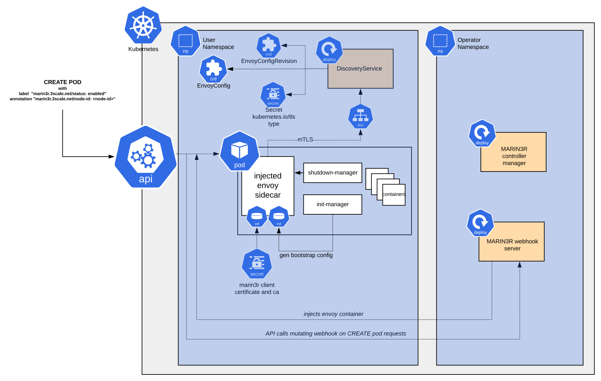

# Sidecar injection

marin3r supports transparent injection of envoy sidecar containers into pods via a [kubernetes mutating admission webhook](https://kubernetes.io/docs/reference/access-authn-authz/admission-controllers/#mutatingadmissionwebhook).

## Enable sidecar injection

For sidecar injection of envoy containers into Pods to work in a given namespace, the following prerequisites need to be met:

1. The label `marin3r.3scale.net/discovery-service=<DiscoveryService instance name>` needs to be present in the namespace object.
2. The label `marin3r.3scale.net/status=enabled` needs to be present in the Pod metadata
3. The annotation `marin3r.3scale.net=<nodeID>` needs to be present in the Pod metadata. The annotation's value must match the `spec.nodeID` field of the EnvoyConfig revision holding the config for the envoy config.
4. A client certificate for the envoy proxy to authenticate against the discovery service is required. This needs to be provided through a kubernetes Secret created in the namespac.
5. A static envoy config file or bootstrap configuration needs to be provided to the envoy proxy sidecar with the minimal configuration required to contact the discovery service server.

Points 1, 4 and 5 are managed automatically by marin3r's DiscoveryService controller, by looking into the `spec.enabledNamespaces` field. For example, with the following DiscoveryService resource, the `default` and `test` namespace would get the required resources/labels defined in 1, 4 and 5 created in the namespace.

```yaml
apiVersion: operator.marin3r.3scale.net/v1alpha1
kind: DiscoveryService
metadata:
  name: instance
spec:
  image: quay.io/3scale/marin3r:test
  discoveryServiceNamespace: default
  enabledNamespaces:
    - default
    - test
```

Sidecar injection can also be manually configured for a namespace by creating the required resources manually. The names of the ConfigMap for the bootstrap envoy config and the Secret for the client certificate can be modified using Pod annotations as described in [this table](https://github.com/3scale/marin3r#sidecar-injection-configuration).

The following diagram depicts the sidecar injection.


