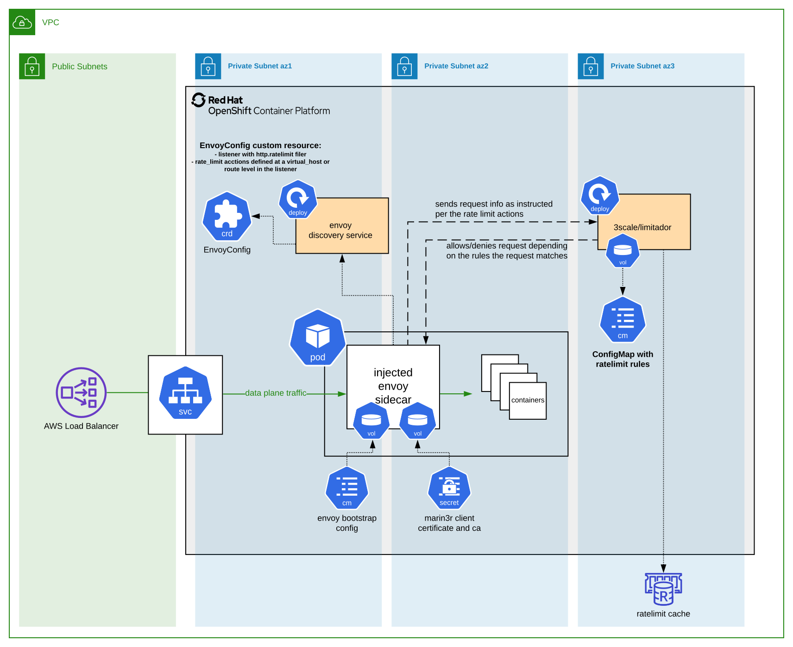
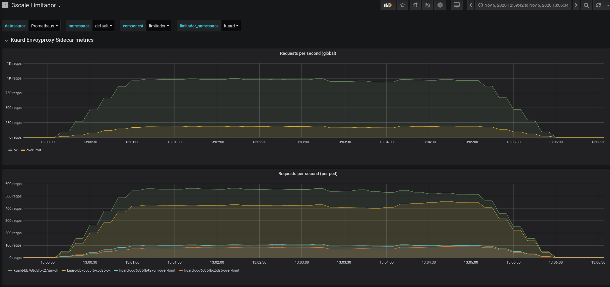
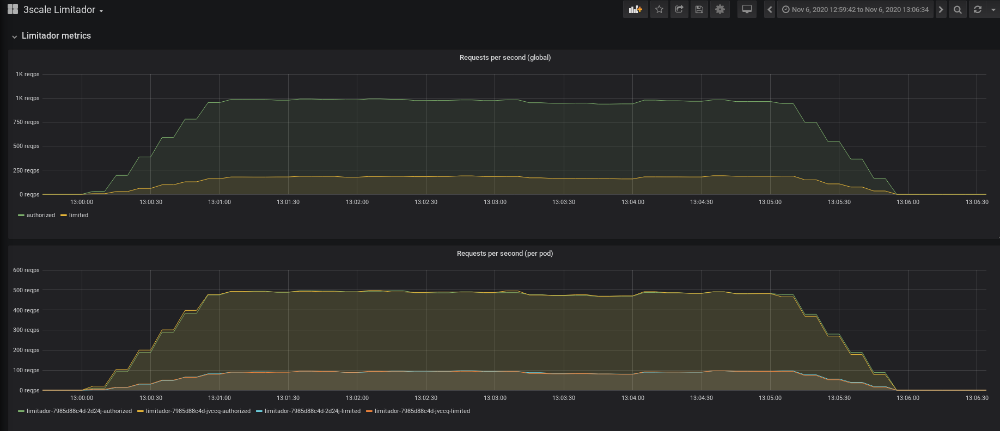

<!-- omit in toc -->
# Ratelimit

The purpose of this use case is to deploy a sample application published via AWS ELB, that will be ratelimited at infrastructure level, thanks to the use the envoyproxy sidecar container injected in the app pod by marin3r, that will be in charge of contacting to a third party ratelimit service, that will allow the request (or not) if it is within the permitted  limits.

The ratelimit application used is called [limitador](https://github.com/3scale/limitador), which by default has a GRPC server implementing the envoy ratelimit service.

This is the network diagram of the Ratelimit use case:



<!-- omit in toc -->
# Table of Contents
- [Requirement](#requirement)
- [Components](#components)
  - [Mandatory](#mandatory)
  - [Optional](#optional)
- [K8s deployment](#k8s-deployment)
- [Monitoring](#monitoring)
  - [Prometheus](#prometheus)
  - [Grafana dashboard](#grafana-dashboard)
- [Benchmarking](#benchmarking)

## Requirement

As a requirement, initially you need to deploy marin3r in a k8s cluster. You can follow the [Installation](../../../README.md#installation) documentation in order to successfully deploy `marin3r-control-manager`, and a `DiscoveryService` instance which by default is deployed on `default` namespace, and it is configured to watch resources on the `default` namespace (`spec.enabledNamespaces`). If you want to do the ratelimit test on a different namespace, just update the `DiscoveryService` field `spec.enabledNamespaces`.

## Components

In order to that that ratelimit test, we need to deploy a few components. Some of them are mandatory, and a few are optional:

### Mandatory

- Application (a sample application deployment called `kuard`):
  - App has `marin3r` enabled, which injects a sidecar defined on kuard `EnvoyConfig`, composed by:
    - Cluster `kuard` points to main application container (`127.0.0.1:8080`)
    - Cluster `kuard_ratelimit` points to limitador headless service (`limitador:8081`)
    - Listener HTTP points to envoyproxy sidecar (`0.0.0.0:38080`)
    - When envoy contacts with the ratelimit service, you can define a timeout, and if there is no response within that timeout (because ratelimit is overloaded taking more time to process the request, or because rateliit service is down), you can choose from envoy to deny the request or pass it to the application. In this case, there is set a 1s timeout, and if there is no answer in this 1 second, request is passed to the application (`failure_mode_deny: false`), so we guarantee that the maximum overhead added by a non working ratelimit service is 1 extra second to the final response time.
  - App service published with `type: LoadBalancer`, which creates a AWS ELB. This service has an annotation to enable proxy protocol on the AWS Load balancer in order to be able to keep the real client IP at envoy level (instead of the k8s node private IP), so it can be used to ratelimit per each real client IP if desired.

- Ratelimit application (a deployment called `limitador`):
  - Limitador Configmap with limits definition (1000 rps per hostname).
  - Limitador headless service published on `limitador:8081`. It is important to use a headless service in order to balance correctly the traffic between limitador pods, otherwise GRPC connections are not well balanced.

- Redis database to persist ratelimit configuration:
  - Redis service
  - Redis statefulset with a persistent volume

### Optional

- Centos pod:
  - Used to executed `hey` tool benchmarks from the cluster, so we ensure network latency does not affect the results. Actually, to achieve better results, this pod should be on another cluster (to not share the network between client and network) and be placed on the same Region (to reduce latency). The client could be a bottle neck for the performance test.
  - This centos is going to public AWS ELB to access the app, so simulating it is a normal client from the same Region
- Prometheus monitoring and grafana dashboard resources

## K8s deployment

* Deploy the redis instance that will keep the limits for different limitador pods:
```bash
kubectl apply -f redis-service.yaml
kubectl apply -f redis-statefulset.yaml
```

* Deploy limitador application. It is important to create the configmap with limitador limits before the deployment, in order to load it from limitador pods. At the moment, if you update the limits configmap you need to restart the pods. Additionally, limitador has an API in order to load limits dynamically, but for simplicity for this test use case a configmap has been used:
```bash
kubectl apply -f limitador-config-configmap.yaml
kubectl apply -f limitador-service.yaml
kubectl apply -f limitador-deployment.yaml
```

* Deploy sample kuard application with proper marin3r label and annotations (in order to be processed by the marin3r discovery service, and inject the envoy sidecar container on every new kuard pod):
```bash
kubectl apply -f kuard-envoyconfig.yaml
kubectl apply -f kuard-service.yaml
kubectl apply -f kuard-deployment.yaml
```

* At this point you shoud see all pods running, and kuard pods should have 2 containers (the one specified in the kuard deployment, and the envoyproxy sidecar container injected by marin3r):
```bash
▶ kubectl get pods
NAME                               READY   STATUS    RESTARTS   AGE
kuard-bb768c5fb-t27qm              2/2     Running   0          3m
kuard-bb768c5fb-x5ds5              2/2     Running   0          3m
limitador-7985d88c4d-7lfd2         1/1     Running   0          5m
limitador-7985d88c4d-mfzs6         1/1     Running   0          5m
marin3r-instance-9d8fddf94-jqjdj   1/1     Running   0          10m
redis-0                            1/1     Running   0          7m
```
* Now you should be able to access to kuard application using the load balancer DNS name:
```
▶ kubectl get service kuard
NAME    TYPE           CLUSTER-IP      EXTERNAL-IP                                                              PORT(S)        AGE
kuard   LoadBalancer   172.30.31.219   ab375134de1ed442e959a28f458abcca-787341357.us-east-1.elb.amazonaws.com   80:31830/TCP   4m
```

* If you go to the browser and paste the `EXTERNAL-IP`, your request will follow the next workflow:
  - The requests will go from your local machine through internet to the public AWS ELB where the app is published
  - Then it will go to the `NodePort` of your k8s cluster nodes
  - Once on a k8s node, it will go to kuard `Service` Virtual IP, and will arrive to an envoyproxy sidecar container inside kuard pod
  - Envoyproxy sidecar container will contact with limitador headless `Service`, to authorize the requests or not:
    - If the request is authorized (within the configured limits), it will send the request to the app container (`0.0.0.0:8080`) in the same pod, and request will end up with a `HTTP 200` response
    - If the request is limited (beyond the limits), request will end up with `HTTP 429` response

## Monitoring

Both `envoyproxy` sidecar and `limitador` applications include built-in prometheus metrics.

### Prometheus

In order to scrape that metrics within a prometheus-operator deployed in the cluster, you need to create a `PodMonitor` resource for every application:
```bash
kubectl apply -f kuard-podmonitor.yaml
kubectl apply -f limitador-podmonitor.yaml
```

### Grafana dashboard
Then, if you have grafana deployed in the cluster, you can import a [3scale Limitador](limitador-grafanadashboard.json) grafana dashboard that we have prepared, which includes:
- Kuard envoyproxy sidecar metrics (globally and per pod)
- Limitador metrics (globally and per pod)
- And for every deployed component (limitador, kuard, redis):
  - Number of pods (total, available, unavaible, pod restarts...)
  - CPU usage per pod
  - Memory usage per pod
  - Network usage per pod

## Benchmarking

* In order to check that the ratelimit is working as expected, you can use any benchmarking tool, like [hey](https://github.com/rakyll/hey)
* You can use if you want a centos pod (better to create it on a different custer within the same Region):
```bash
kubectl apply -f centos-pod.yaml
```
* Connect to centos pod:
```bash
kubectl exec --stdin --tty centos -- /bin/bash
```
* And install `hey` with:
```bash
[root@centos /]# curl -sf https://gobinaries.com/rakyll/hey | sh
```
* Now you can execute the benchmark using the following escenario:

| Item | Value |
|:---:|:---:|
| Target | AWS ELB DNS Name |
| App pods | 2 |
| Limitador pods | 2 |
| Limits | 1.000 rps per hostname |
| Hey duration | 1 minute |
| Hey Traffic | -c 60 -q 20 (around 1.200 rps) |

* Theoretically:
  - It should let pass 1.000 requests, and limit 200 requests per second
  - It should let pass 60 * 1.000 = 60.0000 requests, and limit 60 * 200 = 12.000 requests per minute
  - Each limitador pod should handle half of the traffic (500 rps OK, and 200 rps limited)

```bash
[root@centos /]# hey -z 60s -c 60 -q 20 "http://ab375134de1ed442e959a28f458abcca-787341357.us-east-1.elb.amazonaws.com"

Summary:
  Total:	60.0100 secs
  Slowest:	0.2752 secs
  Fastest:	0.0020 secs
  Average:	0.0102 secs
  Requests/sec:	1192.2171

  Total data:	106578638 bytes
  Size/request:	1489 bytes

Response time histogram:
  0.002 [1]	|
  0.029 [69804]	|■■■■■■■■■■■■■■■■■■■■■■■■■■■■■■■■■■■■■■■■
  0.057 [1231]	|■
  0.084 [261]	|
  0.111 [146]	|
  0.139 [52]	|
  0.166 [0]	|
  0.193 [0]	|
  0.221 [14]	|
  0.248 [12]	|
  0.275 [24]	|


Latency distribution:
  10% in 0.0048 secs
  25% in 0.0060 secs
  50% in 0.0076 secs
  75% in 0.0107 secs
  90% in 0.0180 secs
  95% in 0.0216 secs
  99% in 0.0473 secs

Details (average, fastest, slowest):
  DNS+dialup:	0.0001 secs, 0.0020 secs, 0.2752 secs
  DNS-lookup:	0.0001 secs, 0.0000 secs, 0.0944 secs
  req write:	0.0000 secs, 0.0000 secs, 0.0916 secs
  resp wait:	0.0100 secs, 0.0019 secs, 0.2700 secs
  resp read:	0.0000 secs, 0.0000 secs, 0.0228 secs

Status code distribution:
  [200]	59861 responses
  [429]	11684 responses
```
* We can see that:
  - Client could send 1192.2171rps (about 1200rps)
  - 59861 requests (about 60000) were OK (HTTP 200)
  - 11684 requests (about 12000) were limited (HTTP 429)
  - Average latency (since the request goes out from the client to AWS ELB, k8s node, envoyproxy container, limitador+redis, kuar app container) is 10ms

* In addition, if we do a longer test with 5 minutes traffic for example, you can check with the grafana dashboard how these requests are processed by envoyproxy sidecar container of kuard pods and limitador pods:
  - **Kuard Envoyproxy Sidecar Metrics**:
     - Globally it handles around 1200rps: it permits around 1krps and limits around 200rps  
     - Each envoyproxy sidecar of each kuard pod handles around half of the traffic: it permits around 500rps and limits around 100rps. The balance between pods is not 100% perfect, caused by random iptables forwarding when using a k8s service
     
  - **Limitador Metrics**:
     - Globally it handles around 1200rps: it permits around 1krps and limits around 200rps  
     - Each limitador pod handles around half of the traffic: it permits around 500rps and limits around 100rps. The balance between pods is perfect thanks to using a headless service with GRPC connections
     
